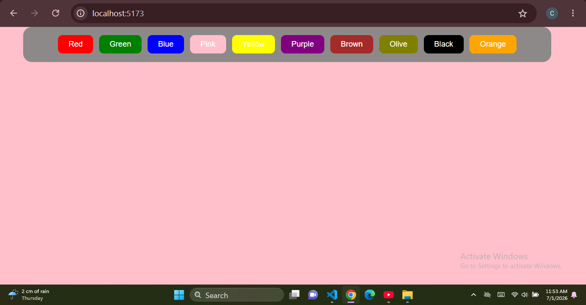

# 🎨 Background Color Changer

A simple React application that changes the background color of the page when a user clicks different color buttons.

## 🚀 Features

- Change background color instantly
- Built with React Hooks (`useState`)
- Responsive and beginner-friendly

## 🛠️ Tech Stack

- React
- JavaScript
- CSS
- Vite

## 📸 Screenshot



## ▶️ Run Locally

```bash
npm install
npm run dev
```

## 👩‍💻 Author

**Chaitali Nagpure**

GitHub: https://github.com/chaitalinagpure187-hash
